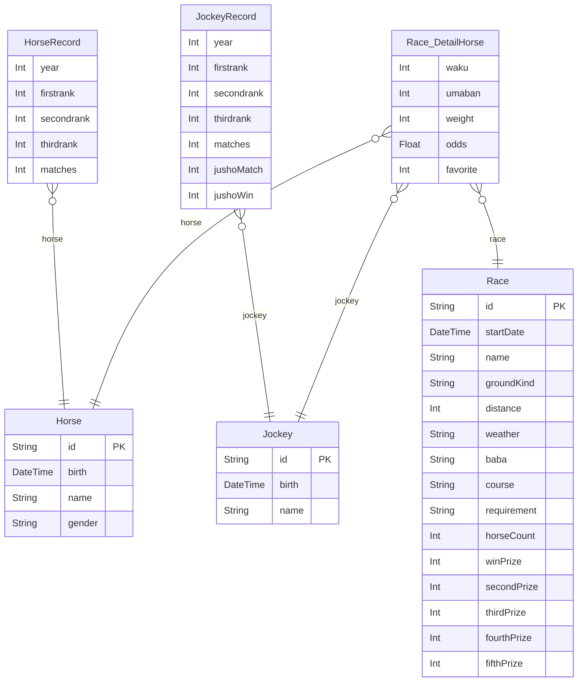

```mermaid
erDiagram

  Horse {
    String id PK 
    DateTime birth  
    String name  
    String gender  
    }
  

  HorseRecord {
    Int year  
    Int firstrank  
    Int secondrank  
    Int thirdrank  
    Int matches  
    }
  

  Jockey {
    String id PK 
    DateTime birth  
    String name  
    }
  

  JockeyRecord {
    Int year  
    Int firstrank  
    Int secondrank  
    Int thirdrank  
    Int matches  
    Int jushoMatch  
    Int jushoWin  
    }
  

  Race {
    String id PK 
    DateTime startDate  
    String name  
    String groundKind  
    Int distance  
    String weather  
    String baba  
    String course  
    String requirement  
    Int horseCount  
    Int winPrize  
    Int secondPrize  
    Int thirdPrize  
    Int fourthPrize  
    Int fifthPrize  
    }
  

  Race_DetailHorse {
    Int waku  
    Int umaban  
    Int weight  
    Float odds  
    Int favorite  
    }
  
    HorseRecord o{--|| Horse : "horse"
    JockeyRecord o{--|| Jockey : "jockey"
    Race_DetailHorse o{--|| Race : "race"
    Race_DetailHorse o{--|| Horse : "horse"
    Race_DetailHorse o{--|| Jockey : "jockey"
```
