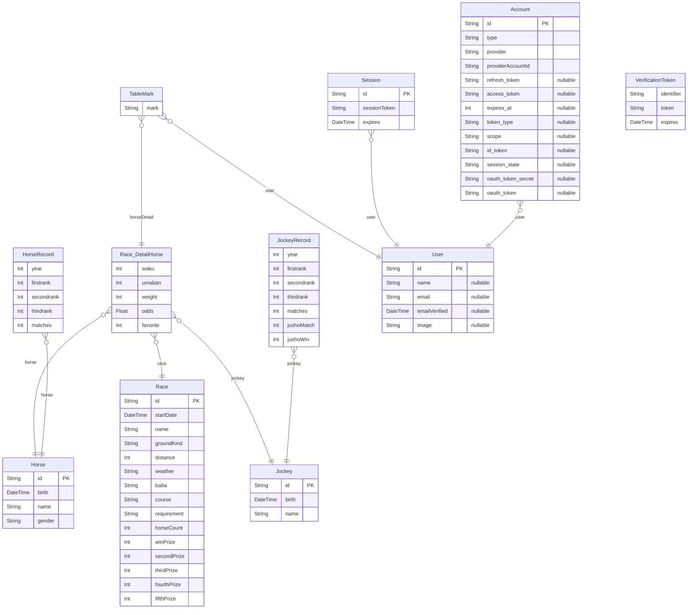

```mermaid
erDiagram

  Horse {
    String id PK 
    DateTime birth  
    String name  
    String gender  
    }
  

  HorseRecord {
    Int year  
    Int firstrank  
    Int secondrank  
    Int thirdrank  
    Int matches  
    }
  

  Jockey {
    String id PK 
    DateTime birth  
    String name  
    }
  

  JockeyRecord {
    Int year  
    Int firstrank  
    Int secondrank  
    Int thirdrank  
    Int matches  
    Int jushoMatch  
    Int jushoWin  
    }
  

  Race {
    String id PK 
    DateTime startDate  
    String name  
    String groundKind  
    Int distance  
    String weather  
    String baba  
    String course  
    String requirement  
    Int horseCount  
    Int winPrize  
    Int secondPrize  
    Int thirdPrize  
    Int fourthPrize  
    Int fifthPrize  
    }
  

  Race_DetailHorse {
    Int waku  
    Int umaban  
    Int weight  
    Float odds  
    Int favorite  
    }
  

  Account {
    String id PK 
    String type  
    String provider  
    String providerAccountId  
    String refresh_token  "nullable"
    String access_token  "nullable"
    Int expires_at  "nullable"
    String token_type  "nullable"
    String scope  "nullable"
    String id_token  "nullable"
    String session_state  "nullable"
    String oauth_token_secret  "nullable"
    String oauth_token  "nullable"
    }
  

  Session {
    String id PK 
    String sessionToken  
    DateTime expires  
    }
  

  User {
    String id PK 
    String name  "nullable"
    String email  "nullable"
    DateTime emailVerified  "nullable"
    String image  "nullable"
    }
  

  TableMark {
    String mark  
    }
  

  VerificationToken {
    String identifier  
    String token  
    DateTime expires  
    }
  
    HorseRecord o{--|| Horse : "horse"
    JockeyRecord o{--|| Jockey : "jockey"
    Race_DetailHorse o{--|| Race : "race"
    Race_DetailHorse o{--|| Horse : "horse"
    Race_DetailHorse o{--|| Jockey : "jockey"
    Account o{--|| User : "user"
    Session o{--|| User : "user"
    TableMark o{--|| User : "user"
    TableMark o{--|| Race_DetailHorse : "horseDetail"
```
